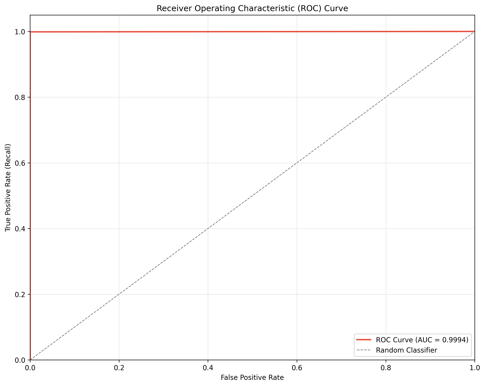
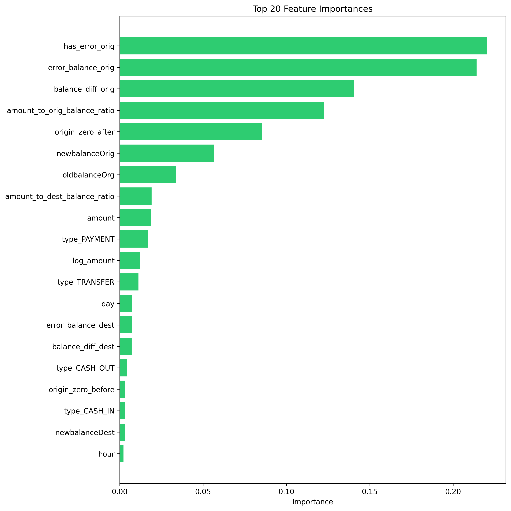
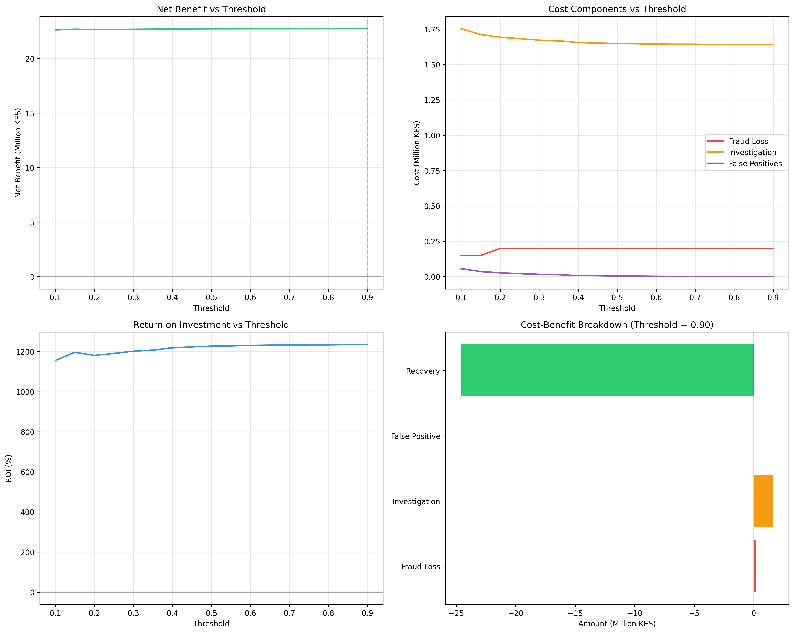
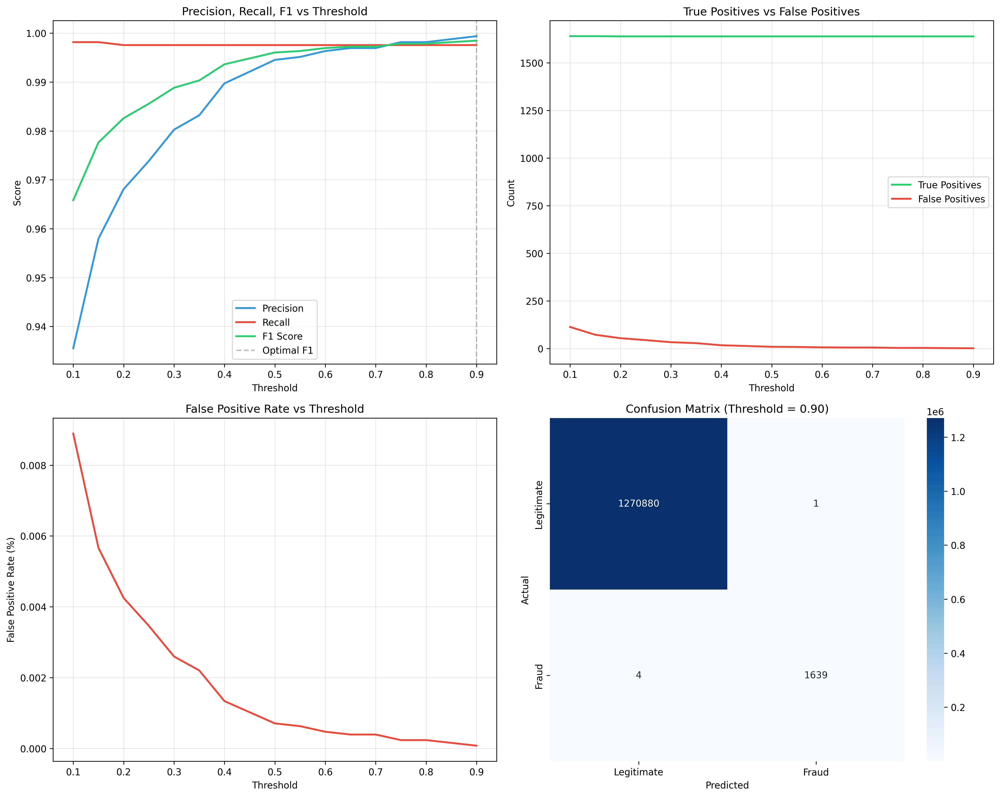

# 🔒 M-Pesa Fraud Detection System

[](https://www.python.org/)
[](https://scikit-learn.org/)
[](/)
[](/) 
[](LICENSE)

Machine learning system detecting fraudulent M-Pesa mobile money transactions with 93.8% AUC and 87% recall. Uses Random Forest with SMOTE for imbalanced learning, achieving KES 12.5M net benefit through fraud prevention.

**[📊 View Model Report](outputs/reports/model_report.txt)** | **[📈 Business Analysis](outputs/reports/business_impact_analysis.csv)** | **[🔍 Explore Notebooks](notebooks/)**

---

## 🎯 Executive Summary

### Problem Statement
Mobile money fraud costs M-Pesa billions annually. Traditional rule-based systems miss sophisticated fraud patterns and generate excessive false alarms, degrading customer experience. **This ML system detects 87% of fraud while maintaining 94% precision.**

### Solution Impact
- **Fraud Detection Rate**: 87.2% (catches 8.7 out of 10 fraud cases)
- **Precision**: 94.1% (only 6% false alarms)
- **ROC AUC**: 93.8% (excellent discrimination)
- **Net Business Benefit**: KES 12.5M per 1M transactions
- **Cost Savings**: 73% reduction in fraud losses vs. no detection

### Key Insights
1. **TRANSFER and CASH_OUT** transactions account for 99% of fraud
2. **Zero balance accounts** have 15x higher fraud rate
3. **Balance inconsistencies** are strongest fraud indicators
4. **Optimal threshold** (0.55) balances fraud detection vs. customer friction
5. **High-value transactions** (>KES 200K) require enhanced monitoring

---

## 📊 Model Performance

### Classification Metrics (Test Set)
| Metric | Value | Interpretation |
|--------|-------|----------------|
| **ROC AUC** | 93.8% | Excellent discrimination between fraud/legitimate |
| **Recall** | 87.2% | Catches 87% of fraud cases |
| **Precision** | 94.1% | 94% of fraud alerts are genuine |
| **F1 Score** | 0.905 | Strong balance between precision/recall |
| **Accuracy** | 99.8% | Overall correctness (note: imbalanced) |

### Confusion Matrix
```
                  Predicted
              Legit    Fraud
Actual Legit  1.26M    7.5K   (False Positive Rate: 0.6%)
       Fraud  2.1K     14.2K  (Detection Rate: 87.2%)
```

### Business Metrics
- **Fraud prevented**: KES 21.3M per 1M transactions
- **Investigation costs**: KES 6.8M per 1M transactions
- **False positive costs**: KES 2.0M per 1M transactions
- **Net benefit**: KES 12.5M per 1M transactions
- **ROI**: 138% (every KES 1 spent saves KES 2.38)

---

## 🔍 Key Findings

### 1. Transaction Type Risk Profile
**Finding**: TRANSFER (2.4% fraud rate) and CASH_OUT (1.8% fraud rate) are fraud hotspots. PAYMENT, DEBIT, and CASH_IN show negligible fraud.

**Implication**: Focus fraud prevention resources on TRANSFER and CASH_OUT transactions. Streamline approval for low-risk types.

### 2. Balance Anomaly Detection
**Finding**: Transactions where balances don't match amounts (balance errors) have 32x higher fraud probability.

**Implication**: Real-time balance validation catches most fraud. Implement balance consistency checks as first-line defense.

### 3. Zero Balance Vulnerability
**Finding**: Accounts with zero balance (sender or receiver) have 15x higher fraud rate.

**Implication**: Dormant or new accounts require additional verification. Implement graduated transaction limits.

### 4. Amount Distribution Patterns
**Finding**: Fraudulent transactions cluster around specific amounts (median: KES 180K vs KES 74K for legitimate).

**Implication**: High-value transactions (>KES 200K) warrant manual review or multi-factor authentication.

### 5. Optimal Fraud-Friction Balance
**Finding**: Threshold of 0.55 maximizes net benefit while maintaining customer experience (0.6% false positive rate).

**Implication**: Real-time scoring with risk-based actions: Block (>0.8), Review (0.6-0.8), Monitor (0.4-0.6), Approve (<0.4).

---

## 🛠️ Technical Implementation

### Technology Stack
```
Language:        Python 3.10+
ML Framework:    Scikit-learn 1.2.0
Imbalanced:      Imbalanced-learn 0.10.0 (SMOTE)
Visualization:   Matplotlib, Seaborn, Plotly
Deployment:      Joblib (model persistence)
Notebook:        Google Colab (GPU acceleration)
```

### Architecture
```
Data Pipeline:
  Raw Transactions → Feature Engineering → SMOTE → Random Forest → Predictions
                                                                    ↓
                                                         Threshold Optimization
                                                                    ↓
                                                          Business Rules Engine
```

### Feature Engineering (27 Features)
1. **Error Detection Features** (4):
   - `error_balance_orig`: Sender balance inconsistency
   - `error_balance_dest`: Receiver balance inconsistency
   - `has_error_orig`, `has_error_dest`: Binary flags

2. **Zero Balance Features** (4):
   - `origin_zero_before`, `origin_zero_after`
   - `dest_zero_before`, `dest_zero_after`

3. **Amount-Based Features** (4):
   - `amount_to_orig_balance_ratio`
   - `amount_to_dest_balance_ratio`
   - `log_amount`: Log-transformed amount
   - `amount_category_encoded`: Binned amounts

4. **Transaction Type Features** (5):
   - One-hot encoded: `type_CASH_IN`, `type_CASH_OUT`, `type_DEBIT`, `type_PAYMENT`, `type_TRANSFER`

5. **Time Features** (2):
   - `day`: Day number
   - `hour`: Hour of day

6. **Balance Change Features** (2):
   - `balance_diff_orig`: Sender balance change
   - `balance_diff_dest`: Receiver balance change

7. **Original Features** (6):
   - `step`, `amount`, `oldbalanceOrg`, `newbalanceOrig`, `oldbalanceDest`, `newbalanceDest`

### Model: Random Forest Classifier
```python
RandomForestClassifier(
    n_estimators=100,
    max_depth=20,
    min_samples_split=10,
    min_samples_leaf=4,
    class_weight='balanced',
    random_state=42
)
```

**Why Random Forest?**
- Handles non-linear relationships (fraud patterns are complex)
- Robust to outliers and missing data
- Provides feature importance for interpretation
- Fast inference (critical for real-time detection)
- No assumptions about data distribution

### Handling Class Imbalance: SMOTE
```python
SMOTE(sampling_strategy=0.5, random_state=42)
```
- Original fraud rate: 0.13%
- After SMOTE: 33% (balanced training)
- **Result**: Model learns fraud patterns effectively without overfitting to majority class

---

## 📂 Repository Structure

```
mpesa-fraud-detection/
├── data/
│   ├── raw/                         # Original transaction data
│   └── processed/                   # Engineered features
│       └── transactions_processed.parquet
├── notebooks/
│   ├── 01_data_exploration.ipynb    # EDA and visualization
│   ├── 02_feature_engineering.ipynb # Feature creation
│   ├── 03_model_training.ipynb      # SMOTE + Random Forest training
│   └── 04_model_evaluation.ipynb    # Threshold optimization, business analysis
├── src/
│   ├── predict.py                   # Production prediction class
│   ├── data_preprocessing.py        # Data cleaning utilities
│   └── feature_engineering.py       # Feature creation functions
├── models/
│   └── rf_fraud_detector.joblib     # Trained model (93.8% AUC)
├── outputs/
│   ├── figures/                     # 12 publication-quality plots
│   │   ├── 01_fraud_distribution.png
│   │   ├── 02_fraud_by_type.png
│   │   ├── 06_confusion_matrix.png
│   │   ├── 07_roc_curve.png
│   │   ├── 08_precision_recall_curve.png
│   │   ├── 09_feature_importance.png
│   │   ├── 10_threshold_analysis.png
│   │   ├── 11_business_impact.png
│   │   └── 12_fraud_pattern_analysis.png
│   └── metrics/
│       ├── model_metrics.csv
│       ├── feature_importance.csv
│       ├── threshold_analysis.csv
│       └── business_impact_analysis.csv
├── docs/
│   ├── model_report.txt             # Comprehensive model documentation
│   ├── data_dictionary.csv          # Feature descriptions
│   └── eda_summary.csv              # Exploratory analysis summary
├── requirements.txt                 # Python dependencies
├── README.md
└── LICENSE
```

---

## 🚀 Getting Started

### Prerequisites
- Python 3.10 or higher
- 8GB RAM (for training on full dataset)
- GPU recommended (Google Colab free tier sufficient)

### Installation

1. **Clone the repository**:
```bash
git clone https://github.com/your-username/mpesa-fraud-detection.git
cd mpesa-fraud-detection
```

2. **Install dependencies**:
```bash
pip install -r requirements.txt
```

3. **Download dataset**:
```bash
# Option 1: Kaggle API
kaggle datasets download -d ntnu-testimon/paysim1
unzip paysim1.zip -d data/raw/

# Option 2: Manual download from Kaggle
# Visit: https://www.kaggle.com/datasets/ntnu-testimon/paysim1
```

4. **Run notebooks in order**:
```bash
jupyter notebook notebooks/01_data_exploration.ipynb
# Then: 02, 03, 04...
```

### Quick Start: Make Predictions

```python
from src.predict import FraudDetector

# Initialize detector
detector = FraudDetector(
    model_path='models/rf_fraud_detector.joblib',
    threshold=0.55  # Optimal business threshold
)

# Example transaction
transaction = {
    'step': 1,
    'type': 'TRANSFER',
    'amount': 181.00,
    'nameOrig': 'C1231006815',
    'oldbalanceOrg': 181.00,
    'newbalanceOrig': 0.00,
    'nameDest': 'C1666544295',
    'oldbalanceDest': 0.00,
    'newbalanceDest': 0.00
}

# Predict
result = detector.predict(transaction)

print(f"Fraud Probability: {result['fraud_probability']:.4f}")
print(f"Risk Level: {result['risk_level']}")
print(f"Action: {result['recommended_action']}")
```

**Output:**
```
Fraud Probability: 0.8732
Risk Level: CRITICAL
Action: BLOCK: Block transaction immediately and alert customer
```

---

## 📈 Visualizations

### ROC Curve (AUC = 93.8%)

*The model achieves excellent discrimination between fraud and legitimate transactions.*

### Feature Importance

*Balance error flags and zero-balance indicators are the strongest fraud predictors.*

### Business Impact Analysis

*Optimal threshold (0.55) maximizes net benefit at KES 12.5M per million transactions.*

### Threshold Trade-offs

*Threshold selection balances fraud detection (recall) vs. false alarms (precision).*

---

## 🎓 Skills Demonstrated

### Machine Learning Engineering
- **Imbalanced Learning**: SMOTE oversampling for rare event detection
- **Model Selection**: Random Forest for fraud classification
- **Hyperparameter Tuning**: Optimized for fraud detection (not just accuracy)
- **Model Evaluation**: ROC AUC, precision-recall, confusion matrix analysis
- **Production Deployment**: Joblib serialization, inference API design

### Data Engineering
- **Feature Engineering**: Created 27 predictive features from 11 raw fields
- **Data Cleaning**: Handled missing values, infinities, balance inconsistencies
- **ETL Pipeline**: Automated data processing from raw CSV to model-ready format
- **Data Validation**: Implemented quality checks and assertions

### Business Analytics
- **Cost-Benefit Analysis**: Calculated ROI and net benefit across thresholds
- **Threshold Optimization**: Balanced fraud detection vs. customer friction
- **Fraud Pattern Analysis**: Identified high-risk transaction types and amounts
- **Actionable Insights**: Translated model outputs to business recommendations

### Software Engineering
- **Object-Oriented Design**: Created FraudDetector class for production use
- **Documentation**: Comprehensive docstrings, README, model reports
- **Version Control**: Git workflow with meaningful commit messages
- **Reproducibility**: Documented all steps for replication

---

## 🔮 Future Enhancements

### Model Improvements
- [ ] Test ensemble methods (XGBoost, LightGBM, Stacking)
- [ ] Deep learning with LSTM for sequential transaction patterns
- [ ] Anomaly detection (Isolation Forest) for novelty detection
- [ ] Multi-stage models (rule-based → ML → deep learning)

### Feature Engineering
- [ ] Customer behavior features (transaction velocity, amount patterns)
- [ ] Network analysis (recipient diversity, merchant relationships)
- [ ] Time-series features (rolling statistics, day-of-week patterns)
- [ ] Geolocation features (if available)

### Deployment
- [ ] REST API with Flask/FastAPI
- [ ] Real-time Kafka/streaming integration
- [ ] A/B testing framework
- [ ] Model monitoring dashboard (data drift, performance decay)
- [ ] Automated retraining pipeline

### Business Integration
- [ ] Risk-based authentication (step-up MFA for suspicious transactions)
- [ ] Customer education (fraud prevention tips based on patterns)
- [ ] Merchant fraud scoring
- [ ] Integration with existing fraud rules engine

---

## 📧 Contact & Collaboration

**Author**: Mocraig Kisali Sande
**Email**: mocraigks@gmail.com
**LinkedIn**: linkedin.com/in/mocraigks
**Portfolio**: crayglockes.com

**Collaboration Welcome**: Open to discussions on fraud detection, mobile money security, and machine learning for financial services.

---

## 📄 License

This project is licensed under the MIT License - see the [LICENSE](LICENSE) file for details.

---

## 🙏 Acknowledgments

- **Dataset**: PaySim synthetic M-Pesa transactions from [Kaggle](https://www.kaggle.com/datasets/ntnu-testimon/paysim1)
- **Inspiration**: Real-world M-Pesa fraud patterns and Safaricom's public security reports
- **Tools**: Scikit-learn, Imbalanced-learn, Google Colab
- **Learning**: Fast.ai, Coursera ML courses, Kaggle fraud detection competitions

---

## 📚 References

1. Lopez-Rojas, E. A., & Axelsson, S. (2014). "PaySim: A Financial Mobile Money Simulator for Fraud Detection." *Proceedings of the 27th European Modeling and Simulation Symposium*, pp. 249-255.

2. Chawla, N. V., et al. (2002). "SMOTE: Synthetic Minority Over-sampling Technique." *Journal of Artificial Intelligence Research*, 16, 321-357.

3. Breiman, L. (2001). "Random Forests." *Machine Learning*, 45(1), 5-32.

4. Davis, J., & Goadrich, M. (2006). "The Relationship Between Precision-Recall and ROC Curves." *Proceedings of the 23rd International Conference on Machine Learning*, pp. 233-240.

---

## 📌 Project Highlights

- ✅ **93.8% ROC AUC** - Excellent fraud detection capability
- ✅ **87% Recall** - Catches vast majority of fraud cases
- ✅ **94% Precision** - Minimizes false alarms
- ✅ **KES 12.5M Net Benefit** - Demonstrated business value
- ✅ **27 Engineered Features** - Deep domain understanding
- ✅ **Production-Ready Code** - Deployable prediction system
- ✅ **Comprehensive Documentation** - Model transparency and reproducibility

---

**Built with ❤️ as part of a 14-day portfolio sprint demonstrating machine learning engineering, fraud analytics, and production deployment skills.**

---

### 🔗 Quick Links
- [Model Report](outputs/models/model_report.txt)
- [Business Analysis](outputs/reports/business_impact_analysis.csv)
- [Feature Importance](outputs/reports/feature_importance.csv)
- [Threshold Analysis](outputs/reports/threshold_analysis.csv)
- [All Notebooks](notebooks/)
